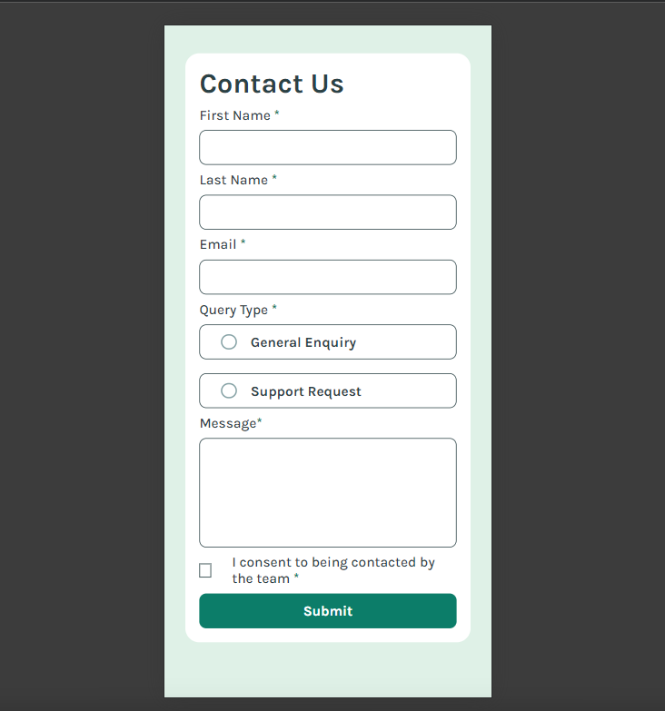

# Frontend Mentor - Contact form solution

This is a solution to the [Contact form challenge on Frontend Mentor](https://www.frontendmentor.io/challenges/contact-form--G-hYlqKJj). Frontend Mentor challenges help you improve your coding skills by building realistic projects.

## Table of contents

- [Overview](#overview)
  - [The challenge](#the-challenge)
  - [Screenshot](#screenshot)
  - [Links](#links)
- [My process](#my-process)
  - [Built with](#built-with)
  - [What I learned](#what-i-learned)
  - [Continued development](#continued-development)
  - [Useful resources](#useful-resources)
- [Author](#author)
- [Acknowledgments](#acknowledgments)

## Overview

### The challenge

Users should be able to:

- Complete the form and see a success toast message upon successful submission.
- Receive form validation messages if:
  - A required field has been missed.
  - The email address is not formatted correctly.
- Complete the form only using their keyboard.
- Have inputs, error messages, and the success message announced on their screen reader.
- View the optimal layout for the interface depending on their device's screen size.
- See hover and focus states for all interactive elements on the page.

### Screenshot



### Links

- Solution URL: https://github.com/willsf2021/Contact-Form-from-Frontend-Mentor
- Live Site URL: https://willsf2021.github.io/Contact-Form-from-Frontend-Mentor

## My process

### Built with

- Semantic HTML5 markup
- CSS custom properties
- Flexbox
- Mobile-first workflow
- Vanilla JavaScript

### What I learned

During this project, I deepened my understanding of form validations, particularly how to efficiently implement them using loops. This approach helped to reduce code redundancy and made the validation process more manageable, especially when dealing with multiple input fields. Here's an example of how I used loops for form validation:

```js
function isEmailValid(email) {
    const re = /^[^\s@]+@[^\s@]+\.[^\s@]+$/;
    return re.test(email);
  }

  for (let i = 0; i < arrayInputsText.length; i++) {
    if (arrayInputsText[i].type === "email") {
      if (!isEmailValid(arrayInputsText[i].value)) {
        arrayError[i].style.display = "block";
        arrayInputsText[i].style.borderColor = "red";
        formIsValid = false;
      } else {
        arrayError[i].style.display = "none";
        arrayInputsText[i].style.borderColor = "";
      }
    } else {
      if (arrayInputsText[i].value === "") {
        arrayError[i].style.display = "block";
        arrayInputsText[i].style.borderColor = "red";
        formIsValid = false;
      } else {
        arrayError[i].style.display = "none";
        arrayInputsText[i].style.borderColor = "";
      }
    }
  }

  if (!returnTrueOrFalse()) {
    radioError.style.display = "block";
    formIsValid = false;
  } else {
    radioError.style.display = "none";
  }

  if (!checkBox.checked) {
    checkBoxError.style.display = "block";
    formIsValid = false;
  } else {
    checkBoxError.style.display = "none";
  }
  ```

### Continued development

IMoving forward, I plan to focus on refining the responsiveness of the form by working on media queries for desktop devices. This will ensure that the form looks and functions optimally across different screen sizes, providing a consistent user experience on larger screens.

### Useful resources

- [MDN Web Docs - HTML `<dialog>` Element](https://developer.mozilla.org/en-US/docs/Web/HTML/Element/dialog) - Helpful for understanding the use of the `<dialog>` element.
- [Frontend Mentor Forum](https://www.frontendmentor.io/forum) - Great place for feedback and discussing challenges with other developers.

## Author
- GitHub - [@Willsf2021](https://github.com/willsf2021)
- Frontend Mentor - [@Willsf2021](https://www.frontendmentor.io/profile/willsf2021)

## Acknowledgments

A special thanks to the Frontend Mentor community for providing valuable feedback and support during the development of this project. Also, thanks to the resources and documentation that helped me understand the use of new HTML and CSS features.
